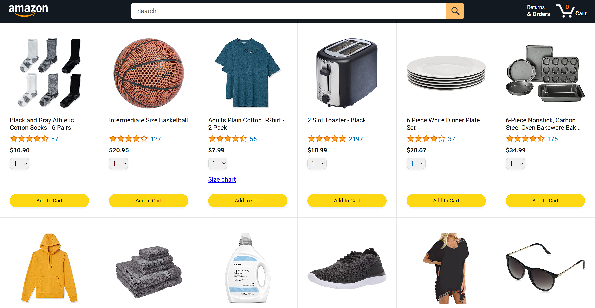
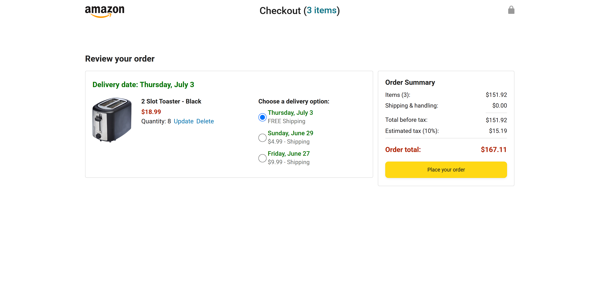
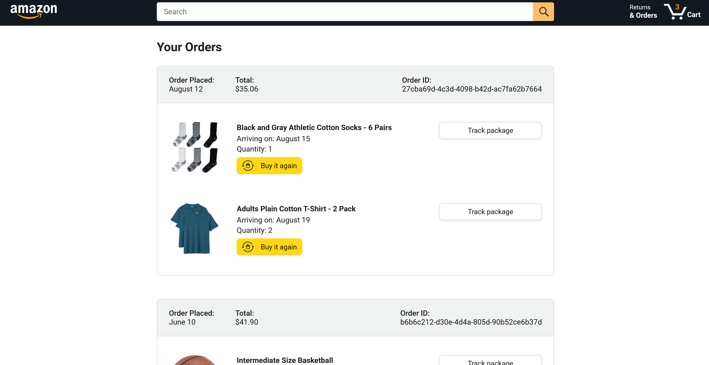
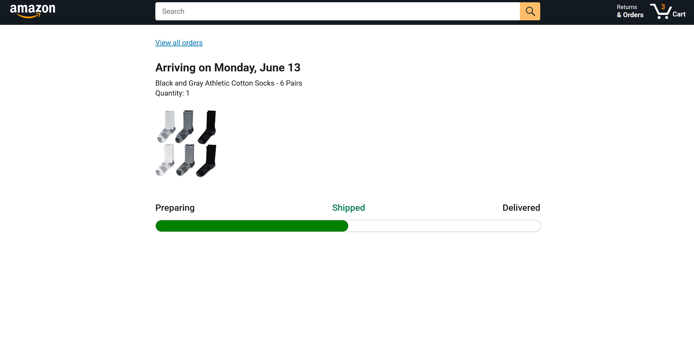

# 🛒 Amazon-Like E-Commerce Website

A simplified Amazon-style online shopping platform built to simulate a real e-commerce experience—from browsing products to final checkout.

## 🌐 Project Overview

This project is a hands-on implementation of an **e-commerce website** built using **JavaScript, HTML, CSS**, and a **custom backend**. It simulates key user flows such as:

- 🛍️ Product browsing and selection  
- 🧾 Cart management and checkout  
- 🗓️ Delivery time scheduling  
- 🛠️ Item customization  

All features are designed to reflect a real-world shopping experience.

## ⚙️ Key Features

- Responsive and modern frontend using **HTML, CSS, and JavaScript**
- Product listing and details view
- Cart system with add/remove/edit functionality
- Checkout flow with confirmation
- Delivery scheduling form
- Backend logic to handle item data, checkout processing, and delivery simulation

## 🧠 What I Learned

- Improved **frontend-backend integration**
- Developed **realistic user flows** for e-commerce
- Enhanced **problem-solving and debugging skills** through iterative testing
- Built patience and discipline with **trial-and-error development**

## 🛠️ Tools & Technologies

- **HTML/CSS**: UI and styling
- **JavaScript**: Interactivity and frontend logic
- **Backend**: Custom implementation (can specify Node.js, Flask, etc. if applicable)
- **Git** & **GitHub**: Version control and project collaboration

## 📷 Screenshots

## 🚀 How to Run the Project
- Download the ZIP and extract it
- Open the file in VS Code
- Right-click on amazon.html in the file explorer.
- Select "Open with Live Server".
